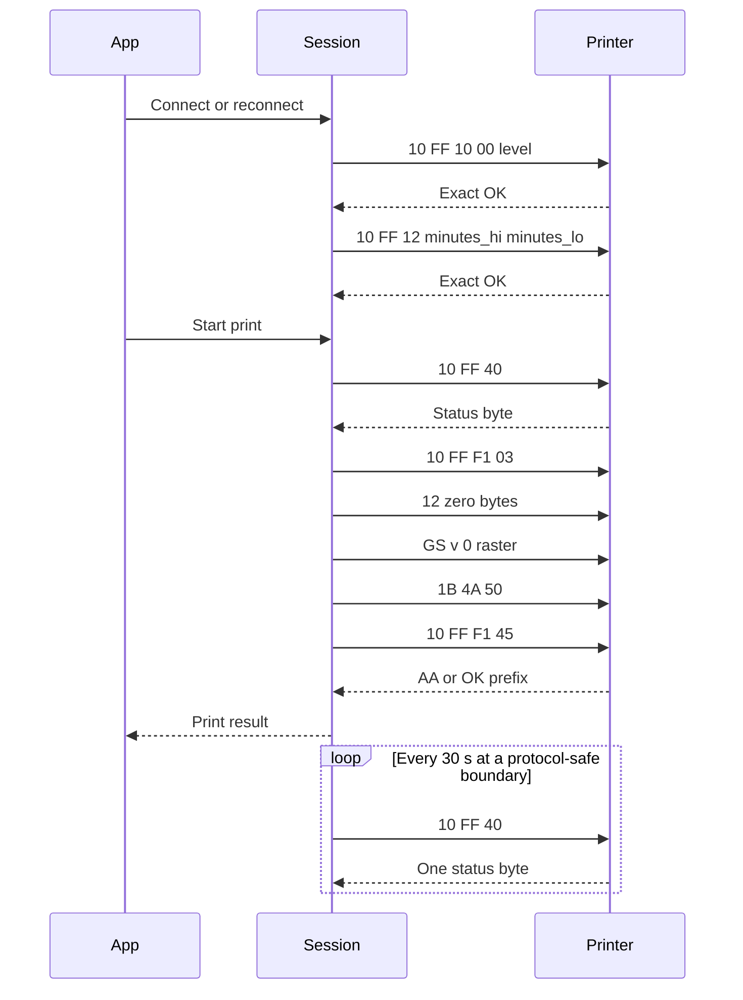
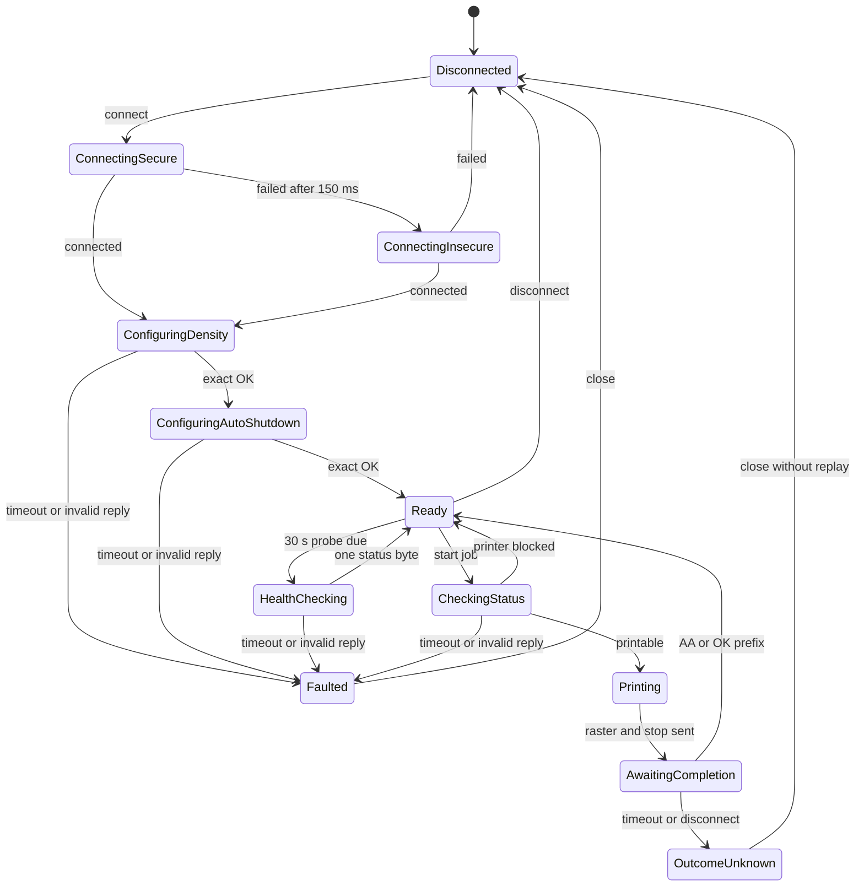

# LuckP D1X 蓝牙经典串口互操作协议

## 1. 文档边界

本文描述叮当小印 Android 应用与 `LuckP_D1X_` 系列打印机之间、为实现独立互操作所需的最小协议事实。分析基线为：

- Android 包名：`com.dingdang.newprint`
- 版本名：`2.7.19`
- 版本号：`657`
- 目标打印机名称前缀：`LuckP_D1X_`
- SDK 设备实现：`LuckP_D1X`

本文只把 Android APK 的可观察行为、Android 蓝牙系统状态和后续真机结果视为协议证据。重构前的 Rust 代码已知存在协议错误，其 UUID、传输类型、命令、分帧、长度、字节序、分块、初始化序列和图像编码均不属于证据，也不得用于形成或佐证本文结论。

本文记录的是互操作性事实，不是对 APK 源码的复制。未在本文列出的 SDK 命令不属于 D1X 最小实现范围。

规范关键字“必须”“不得”“应”“可以”用于约束新的实现；“Android 行为”仅表示该版本应用的观测基线。

## 2. 证据等级

| 等级 | 含义 | 本文用途 |
| --- | --- | --- |
| A | Android 真机蓝牙系统状态或真实打印结果 | 传输类型、已解析的 SPP 服务、当次 RFCOMM 参数、最终打印验证 |
| B | `2.7.19` APK 的互操作性静态分析 | 型号映射、连接策略、命令、超时、响应判定、光栅编码、应用调用时序 |
| C | 为处理流式 I/O 和失败恢复而制定的重实现要求 | 状态机、缓冲、超时、重试和防止重复打印的约束 |

关键事实与证据如下：

| 事实 | 等级 | 说明 |
| --- | --- | --- |
| D1X 的实际数据链路是 Bluetooth Classic RFCOMM/SPP | A + B | 真机存在 BR/EDR RFCOMM 连接；APK 的 D1X 路由也选择经典蓝牙客户端 |
| SPP UUID 为 `00001101-0000-1000-8000-00805F9B34FB` | A + B | 真机 SDP/RFCOMM 状态与 APK 连接代码一致 |
| 当次真机 RFCOMM channel 为 `1`、MTU 为 `990` | A | 仅是该设备与该次协商结果，不是固定协议常量 |
| 命令、响应规则和超时 | B | 来自 APK 的 D1X 普通打印路径；Status 命令已由 DEX 指令与 JADX 结果交叉核验 |
| 自动关机命令、字节序和“手动关闭”取值 | B | 来自 APK `BaseNormalDevice` 的命令构造与 Android `2.7.19` 中文界面取值映射 |
| Rust 启动初始化与欢迎小票 | A | `2026-08-08` 在 macOS 真机上主动发现 `LuckP_D1X_*`，密度与“手动关闭”均取得精确 `OK`，随后成功打印 `5384` 字节欢迎光栅 |
| `30 s` 健康探测与重连调度 | A + C | Android D1X 没有专用心跳；Rust 在协议安全边界串行复用 Status；macOS 真机已验证空闲探测、helper/链路故障识别、自动重建 RFCOMM 和恢复后的 Status 往返 |
| `GS v 0` 单色光栅格式 | B | 来自 APK 的默认 D1X 图像转换路径 |
| 流式累计、请求串行化与禁止危险重放 | C | 用于弥补 Android 实现依赖单次 `read` 边界的问题 |

## 3. 型号选择与传输类型

名称以 `LuckP_D1X_` 开头的设备映射到 `LuckP_D1X`。该型号的枚举类别虽然是 `CLASSIC_BLE`，但型号属性 `isBleEnable=false`。Android SDK 的实际选择条件因此落到经典蓝牙客户端，而不是 BLE GATT 客户端。

结论：新的 D1X 实现必须使用 Bluetooth Classic RFCOMM/SPP。`CLASSIC_BLE` 不能被解释为当前 D1X 路径使用 BLE；任何既有 BLE service、characteristic 或 GATT MTU 假设都不得带入本协议。

## 4. RFCOMM 连接

### 4.1 服务发现和地址

- SPP UUID：`00001101-0000-1000-8000-00805F9B34FB`
- 真机观测 channel：`1`
- 真机观测 RFCOMM MTU：`990`

实现应通过 SDP 解析 SPP channel，并允许显式配置 channel 作为受控回退。不得把 `1` 编译为不可变协议常量。MTU `990` 只用于诊断和调优；上层不得假设一次写入或一次读取等于一个 MTU、一个 RFCOMM 帧或一个协议消息。

默认实现必须主动执行 BR/EDR 发现，并再次按 `LuckP_D1X_` 名称前缀过滤结果。发现一个候选时自动选中；发现多个候选时必须显示名称和 MAC 地址，由用户明确选择。显式地址只作为无交互部署或诊断场景的覆盖值。规范和 fixtures 不保存真实 MAC 地址。

### 4.2 Android 连接策略

Android 行为如下：

1. 取消正在进行的设备发现；若确实取消了发现，连接前等待约 `150 ms`。
2. 使用 SPP UUID 创建 secure RFCOMM socket 并连接。
3. secure 连接失败时等待 `150 ms`。
4. 使用相同 SPP UUID 创建 insecure RFCOMM socket 并重试。
5. 连接成功后创建输入、输出流并启动持续读取任务。

新的实现应优先 secure 连接，并将 insecure fallback 作为明确可配置的兼容策略。两次连接均失败时必须关闭 socket，进入断开状态，并向调用方返回连接错误。

### 4.3 Linux BlueZ 映射

Linux 默认实现通过 BlueZ Profile API 注册 SPP client profile，并调用选中设备的 `ConnectProfile`：

- `Role=client`；
- 不提供 `Channel`，由 BlueZ 根据 SPP UUID 执行远端 SDP；
- `RequireAuthentication=false`，允许未预先配对的 D1X 使用低安全连接；
- `RequireAuthorization=false`；
- 不主动设置 `Trusted`，也不把 `Pair` 作为连接前置步骤。

`ConnectProfile` 与 profile 的连接请求接收必须并发执行；实现只接受 MAC 地址与所选设备一致的连接请求。BlueZ 完成交付后，应用取得已经连接的 RFCOMM 文件描述符。扫描结束到连接开始之间保留 Android 路径观测到的约 `150 ms` 间隔。

该映射对应 Android 的 insecure fallback，并消除了 `bluetoothctl pair`、`trust` 和手工查询 channel 的运行前置步骤。若未来真机证据表明某个固件强制认证，应增加显式的可选认证策略，而不得重新把全局手工配对设为默认要求。

### 4.4 macOS IOBluetooth 映射

macOS 默认实现使用系统 IOBluetooth framework，保持与 Linux 相同的主动发现、自动 SDP 和无预配对目标：

- 使用 `IOBluetoothDeviceInquiry` 主动执行 BR/EDR inquiry，完成后按 `LuckP_D1X_` 名称前缀过滤候选；
- discovery 必须在进程主线程持有并泵送 IOBluetooth RunLoop；配置的扫描期限到达后应显式 `stop` inquiry，不得依赖某些系统版本不会发送的 `deviceInquiryStarted` 回调或自动完成行为；
- inquiry 完全停止后，对仍无缓存名称的设备可在有界总预算内执行同步 remote-name request；不得在 inquiry 活跃期间或 delegate 回调内发起该请求；
- 无名称设备的地址必须保留到诊断阶段，不得静默当作“未发现设备”丢弃；
- 使用 `IOBluetoothSDPUUID::uuid16(0x1101)` 表示 SPP 服务，执行 `performSDPQuery` 后取得对应 service record，再用 `getRFCOMMChannelID` 解析 channel；
- 使用解析出的 channel 建立 RFCOMM 连接，不调用配对、信任或用户确认面板 API，也不把系统中已存在的配对记录作为连接前置条件；
- discovery 由父进程主线程持有 IOBluetooth inquiry；连接阶段由同一可执行文件启动的内部 helper 子进程在其主线程持有 device、service record 和 RFCOMM channel，父进程通过有界长度帧传递连接、读写和关闭请求；
- SPP 查询必须同时观察 completion 状态与 `getServiceRecordForUUID`；若系统已填充 record 但未发送 completion 回调，应继续解析 RFCOMM channel，同时保活未完成查询的 delegate；
- 连接建立后通过 `getMTU` 取得当前 RFCOMM channel 的 MTU，并将每次逻辑写入拆成不超过该 MTU 的有序块；不得把真机曾观测到的 `990` 当成固定值；
- inquiry 结果没有可靠 RSSI 时，候选的 RSSI 必须记为 `unknown`，不得伪造数值，也不得因此排除候选。

命令行程序首次运行时，macOS 可能要求启动它的宿主应用获得蓝牙权限。打包为应用时，`Info.plist` 必须包含 `NSBluetoothAlwaysUsageDescription`；权限拒绝必须作为可操作的发现或连接错误返回，不能伪装成“未找到打印机”。

### 4.5 写入行为

Android 对每次逻辑写入采用以下行为：

- 写入前等待 `10 ms`。
- 将逻辑数据按最多 `16384` 字节切块。
- 每个块写入后立即 flush。
- 不在应用层添加长度、校验和或 BLE 分片头。

这里的 `16384` 是 Android 写流的分块大小，不是 RFCOMM MTU，也不是打印协议帧大小。实现必须处理 partial write，并保持字节顺序。命令和完整 `GS v 0` 光栅数据都通过同一个字节流发送。

### 4.6 读取行为与消息边界

Android 持续读取任务使用 `8192` 字节缓冲区。该版本实现把一次成功的 stream `read` 结果直接交给等待中的响应过滤器，没有长度前缀，也没有为普通 D1X 回复累计多个读取块。

RFCOMM 是字节流；一次 `read` 的边界不是协议边界。新的实现不得依赖 Android 的偶然读取边界，应满足以下要求：

- 同一连接上最多只有一个等待响应的请求。
- 使用响应类型对应的谓词和 deadline；对于可由确定前缀识别的 `OK` 回复，必须支持跨多次读取累计。
- 当前证据没有确认任何 D1X 异步消息的可靠边界或字节模式。不得从旧 Rust 代码移植所谓异步事件常量，也不得静默丢弃未知数据。
- 若一次读取包含无法明确归属当前请求的额外字节，或异步数据与同步回复发生无法拆分的合并，必须 fail closed。只有获得新的脱敏真机证据后，才能增加对应的分流规则和 fixtures。
- 不得为本节命令发明统一长度帧或 `FC FF` 外层帧。

状态回复只有首字节具有本文定义的意义；在没有多字节状态证据前，新的 Rust session 只接受恰好一个字节。密度和自动关机回复必须分别精确匹配 `OK`；停止回复按第 8 节的两种终止条件判断。无法可靠分流的数据必须导致显式协议错误，而不是静默丢弃。

## 5. D1X 默认能力配置

`LuckP_D1X` 在此 APK 版本中沿用普通卷纸设备配置：

| 属性 | 值 |
| --- | --- |
| 打印宽度 | `384` dots |
| 密度等级 | `0..2` |
| Rust session 默认自动关机分钟数 | `0`，对应“手动关闭” |
| 默认结束走纸 | `80` dots |
| enable mode | `3` |
| 图像压缩 | 禁用 |
| 灰度打印命令 | 禁用 |
| 新命令外层帧 | 禁用 |

因此，D1X 默认打印数据必须使用未压缩的单色 `GS v 0`。压缩路径、灰度路径以及以 `FC FF` 开头的新命令帧均不属于本规范。

## 6. 命令

除光栅数据外，本文范围内命令如下。`level` 和 `dots` 都编码为一个无符号字节；`minutes` 编码为 big-endian `u16`，高字节在前。

| 名称 | 请求字节 | 响应 | 超时 |
| --- | --- | --- | --- |
| Enable | `10 FF F1 03` | 无 | 无 |
| Wake | `00 00 00 00 00 00 00 00 00 00 00 00` | 无 | 无 |
| Status | `10 FF 40` | Android 至少一个状态字节；Rust session 恰好一个 | `3 s` |
| Set density | `10 FF 10 00 level` | 精确的 `4F 4B` | `3 s` |
| Set auto shutdown | `10 FF 12 minutes_hi minutes_lo` | 精确的 `4F 4B` | `3 s` |
| Feed dots | `1B 4A dots` | 无 | 无 |
| Stop job | `10 FF F1 45` | 首字节 `AA`，或 GB2312 文本以 `OK` 开头 | `70 s` |

Status 的末字节已通过原始 DEX 指令与 JADX 反编译结果交叉核验为 `40`；不得根据重构前 Rust 代码或符号常量名称改写为 `80`。

密度命令只接受 `0`、`1`、`2`。自动关机参数是分钟数；Android `2.7.19` 中文界面的“手动关闭”精确映射为 `minutes=0`，对应命令 `10 FF 12 00 00`，不得把 `0` 解释为立即关机。默认结束走纸 `80` 的编码为 `50`，所以默认走纸命令为 `1B 4A 50`。

新的 Rust session 默认使用“手动关闭”。每次 RFCOMM 连接成功后，包括首次连接和每次重连，都必须先设置密度并取得其精确 `OK`，再设置自动关机并独立取得精确 `OK`，之后才能进入 Ready。任一命令写入失败、超时或回复被拒绝时，必须关闭该脏连接。

## 7. 单色光栅编码

### 7.1 Android 默认图片预处理

Android 图片入口首次使用 image mode `0`。应用可能按打印类型和打印机 MAC 恢复用户上次选择的模式，但没有保存值时，普通图片在进入 SDK 光栅编码前采用以下流程：

1. 使用 Android `Canvas.drawBitmap` 的单精度矩阵、双线性过滤和边缘抗锯齿，将图片按宽高比绘制到 `384` 点宽的白色画布；小图同样放大。自动高度先向下取整，因此实际内容宽度可能略小于 `384`，此时按应用的默认居中规则保留白边。
2. 目标画布为 RGB565。Skia 将合成后的 8 位通道就近写入 `R5/G6/B5`：`R5 = (r8 * 9 + 36) / 74`、`G6 = (g8 * 21 + 42) / 85`、`B5 = (b8 * 9 + 36) / 74`。该过程不能简化为直接屏蔽低位。
3. OpenCV 从 RGB565 读取数据时使用 `r = R5 << 3`、`g = G6 << 2`、`b = B5 << 3`，不会复制低位。随后 Android 对得到的 RGBA 数据调用 `COLOR_BGRA2GRAY`，因此不能使用普通 RGB 灰度系数。Rust 的逐像素等价计算是 `gray = (3735 * r + 19235 * g + 9798 * b + 16384) >> 15`。
4. 计算整幅灰度图的均值 `m`，按下表选择 gamma，并对每个灰度值 `v` 计算 `255 * (v / 255)^(1 / gamma)`。
5. 从左到右、从上到下二值化：值大于 `127` 时输出白点并令误差为 `value - 255`，否则输出黑点并令误差为 `value`。
6. 将误差按分母 `32` 扩散到后续像素；越界邻居直接忽略，不重新归一化。

| 灰度均值 `m` | gamma |
| --- | ---: |
| `< 120` | `1.8` |
| `120..130` | `1.7` |
| `130..140` | `1.5` |
| `140..150` | `1.4` |
| `150..160` | `1.3` |
| `160..170` | `1.2` |
| `170..180` | `1.0` |
| `180..190` | `0.9` |
| `190..200` | `0.8` |
| `200..210` | `0.7` |
| `210..220` | `0.6` |
| `220..230` | `0.5` |
| `230..240` | `0.4` |
| `240..250` | `0.3` |
| `>= 250` | `0.2` |

内部像素使用以下误差扩散核，其中 `e` 是当前像素的量化误差：

| 相对坐标 | 增量 |
| --- | ---: |
| `(1, 0)` | `5e / 32` |
| `(2, 0)` | `3e / 32` |
| `(-2, 1)` | `2e / 32` |
| `(-1, 1)` | `4e / 32` |
| `(0, 1)` | `w * e / 32` |
| `(1, 1)` | `4e / 32` |
| `(2, 1)` | `2e / 32` |
| `(-1, 2)` | `2e / 32` |
| `(0, 2)` | `3e / 32` |
| `(1, 2)` | `2e / 32` |

表中下一行中心像素的权重 `w` 取决于当前零基坐标：当 `x <= 1`、`x >= width - 2` 或 `y == height - 2` 时为 `5`，其他位置为 `3`。该规则只在下一行存在时生效。

Android 将该方法命名为 Floyd，但它不是标准的 `7/16` Floyd–Steinberg 核。新的实现必须保留 Canvas 的单精度几何与低精度双线性采样、边缘覆盖、RGB565 就近量化、OpenCV 的补零通道展开、APK 实际通道顺序、上述分段 gamma、阈值、扫描顺序、整数除法及位置相关的扩散权重，不能替换成通用图片缩放器、固定阈值或同名库算法。图片浓度是独立的打印机运行参数，必须由运行时配置选择，不能通过修改像素算法或写死密度档位代替。

Android 的文字模式使用另一套动态阈值；本协议的图片加载路径不得把 image mode `0` 扩散应用到应用自行渲染的文字区段。

### 7.2 数据布局

默认模式使用 ESC/POS `GS v 0`：

| 偏移 | 字段 | 编码 |
| --- | --- | --- |
| `0..2` | 命令 | `1D 76 30` |
| `3` | `m` | 默认 `00` |
| `4..5` | 每行字节数 | `ceil(width / 8)`，little-endian |
| `6..7` | 高度 | 行数，little-endian |
| `8..` | payload | row-major，每行从左到右 |

本规范的默认模式只发送 `m=0`。头部不包含 payload 总长度或校验和；payload 长度必须等于 `ceil(width / 8) * height`。

### 7.3 像素到位

- 对每个像素计算 `(red + green + blue) / 3`。
- 平均值小于 `128` 时为黑点，位值为 `1`；否则为白点，位值为 `0`。
- 每个字节的最高位对应最左侧像素，即 MSB first。
- 每一行独立补齐到完整字节；右侧 padding 位必须为 `0`。
- 行与行之间不得共享一个未满字节。

例：宽 `8`、高 `1`，从黑点开始黑白交替，payload 为 `AA`，完整数据为 `1D 76 30 00 01 00 01 00 AA`。

例：宽 `9`、高 `1`，九个像素全黑，payload 为 `FF 80`；后七位是白色 padding，完整数据为 `1D 76 30 00 02 00 01 00 FF 80`。

普通图片在到达本节编码器前已经由第 7.1 节转换为纯黑白；本节的 `128` 判定用于稳定打包，不能替代图片预处理。

机器可读向量见 `fixtures/d1x-classic-vectors.json`。

## 8. 响应解析

### 8.1 状态字节

Status 回复的第一个字节按位解释：

| 位 | 含义 | 活跃值 |
| --- | --- | --- |
| `0` | 正在打印 | `1` |
| `1` | 上盖打开 | `1` |
| `2` | 缺纸 | `1` |
| `3` | 低电量 | `1` |
| `4` | 过热来源之一 | `1` |
| `5` | 正在充电 | `1` |
| `6` | 过热来源之二 | `1` |
| `7` | 未定义 | 不解析 |

过热条件为 bit 4 或 bit 6 任意一个置位。Android 解析器只使用首字节，但额外状态字节的意义没有证据；新的 Rust session 因此只接受单字节状态回复。空回复、多字节回复、超时或在 deadline 内无法取得完整首字节均为失败。

Android D1X 没有专用 ping/pong 命令。新的 Rust 服务复用 Status 作为连接健康探针：请求 `10 FF 40` 是 ping，`3 s` 内收到恰好一个可解析状态字节是 pong。健康探针只判断连接能否完成协议往返；缺纸、开盖、低电、过热或充电等非 Ready 状态仍属于健康 pong，不应触发重连。写入失败、读取失败、超时或回复长度异常必须关闭当前连接。

### 8.2 密度确认

Set density 成功条件是 GB2312 解码后的整个回复精确等于 `OK`，对应字节 `4F 4B`。`OK` 后附带换行或其他字节不满足 Android 的精确判定，必须视为失败或无法分流的协议数据。

### 8.3 自动关机确认

Set auto shutdown 与密度命令使用相同的精确确认规则：整个回复必须恰好为 `4F 4B`。它使用普通响应超时 `3 s`；`OK` 后附带换行或其他字节不算成功。该确认只提交当前连接的自动关机配置，不能替代重连后的再次初始化。

### 8.4 停止确认

Stop job 成功条件满足其一即可：

- 回复非空且第一个字节为 `AA`；
- 回复按 GB2312 解码后以 `OK` 开头。

该请求最多等待 `70 s`。超时、断开或收到不匹配回复均表示作业完成状态未知；不能据此自动重发光栅数据。

## 9. 普通卷纸打印时序

Android 应用层与 SDK 层的时机不同，必须区分：

1. Android 应用进入打印页、重新连接或修改打印属性时会设置密度；只有用户在设备设置界面选择自动关机选项时，才会发送自动关机命令。Android D1X 的连接初始化不会自动设置关机时间。
2. 新的 Rust session 在首次连接及每次重连时，按密度、自动关机的顺序同步完成两项初始化。它们不属于单次打印作业内部的固定命令序列，Ready 长连接上的后续作业不会重复发送。
3. 用户点击打印后，应用先检查连接，再发送 Status。状态获取失败或报告上盖打开、缺纸、低电量、过热、充电等阻断状态时，不进入打印准备；只有应用映射结果为 `-1` 的正常状态才继续。
4. 状态允许后，应用生成或取得位图，再进入普通卷纸打印。
5. SDK 依次发送 Enable、Wake、`GS v 0` 光栅、Feed dots、Stop job。
6. Stop job 得到有效确认后，单次打印才算成功。
7. Rust 服务在打印作业之外每隔 `30 s` 调度一次 Status 健康探测；探测只能在打印 worker 的协议安全边界执行，不能插入渲染完成后的单次打印命令序列。

## 10. 重实现状态机

实现应把连接、配置和打印串行化，禁止两个请求同时竞争同一回复。

连接建立后的配置和打印操作必须由单一 session owner 驱动。状态名称可以不同，但必须保留以下语义：

- 在发送首个作业字节前，连接失败可以安全重连；一旦开始发送光栅，禁止自动重放整个作业。
- Status 超时或格式错误时应 fail closed，不发送 Enable 或光栅。
- 每次新连接和重连都必须重新应用密度与自动关机，且自动关机必须排在密度之后。
- 设置密度和自动关机时，每条命令都只有在独立收到精确 `OK` 后才能提交；任一配置失败都必须关闭连接。
- 健康探测、重连初始化和打印必须由同一个 session owner 串行执行。不得由独立定时线程在打印期间写入 Status 或读取回复。
- 健康探测失败后，空闲 worker 每隔 `30 s` 尝试一次重连；重连成功后必须重新应用密度和自动关机。新打印请求可以触发更早的连接尝试。
- 长时间渲染或打印期间错过的健康周期只能在下一个安全边界合并为一次，不得积压或突发补发多个 Status。
- 健康重连不得重复欢迎小票，也不得自动重放 RetrySafe 或 OutcomeUnknown 作业。
- 任意 partial write、socket 错误或连接断开必须终止当前动作并关闭连接。
- Stop job 超时或断开表示结果未知，不得把作业标记为成功，也不得自动重印。
- 调用方只有在人工确认出纸情况或建立新的幂等策略后，才能重新提交结果未知的作业。
- 异步打印机状态不得被误当成当前命令回复；不能可靠识别时应报告协议错误。

## 11. 未知项和兼容性边界

以下内容尚未由当前证据确定：

- 不同 D1X 固件、区域版本或未来 App 版本是否改变 channel、协商 MTU、响应文本或默认能力。
- secure 与 insecure RFCOMM 在各宿主操作系统上的配对要求和错误差异。
- 回复在分片、合并以及异步状态与同步回复交错时的全部形式。
- 打印机对持续大图的实际背压、最大高度和最优 pacing。
- `m=1..3` 的真机行为；当前 D1X 默认路径仅使用 `m=0`。
- bit 7、额外状态字节以及未列出的异步上报含义。
- `AA` 停止确认后的附加字节是否具有稳定语义。

实现不得用猜测补全这些字段。发现新行为时，应保存脱敏的请求、回复、App/固件版本和复现步骤，再更新本规范和 fixtures。

当前 Rust transport 的可执行目标包括 Linux 和 macOS。Linux 默认路径通过 BlueZ BR/EDR discovery 取得候选设备，再通过不指定 channel 的 SPP client profile 让 BlueZ 自动执行 SDP 并建立 RFCOMM 连接；macOS 默认路径通过 IOBluetooth inquiry 取得候选设备，查询 SPP `0x1101` service record，解析 RFCOMM channel 后由专用 RunLoop 线程建立和维护连接。两种平台都不要求预先配对或信任设备。显式 MAC 和 channel 仅保留为无交互部署或诊断回退，不属于默认路径。

## 12. 最小真机验证

在不启用全局蓝牙抓包的前提下，最小验证应按以下顺序执行：

1. 在 Linux 或 macOS 测试主机上清除该 D1X 的既有配对和信任状态；macOS 先为启动程序的宿主应用授予蓝牙权限。
2. 由 Rust 程序主动执行 BR/EDR 发现；若出现多个候选，确认列表包含名称和 MAC，并人工选择目标设备。macOS 的 RSSI 可以显示为 `unknown`。
3. Linux 由 BlueZ SPP profile 自动解析 channel；macOS 由 IOBluetooth 查询 SPP `0x1101` service record 并调用 `getRFCOMMChannelID`。记录解析值和协商 MTU，不持久化真实 MAC。
4. 建立 RFCOMM 连接，设置当前选定密度；确认回复精确为 `4F 4B`。
5. 随后发送默认“手动关闭”命令 `10 FF 12 00 00`；确认它独立回复精确的 `4F 4B`。
6. 发送 Status；确认 `3 s` 内可解析，且打印机处于可打印状态。
7. 发送一张高度尽可能小、内容确定的单色测试图，仅打印一次。
8. 发送 `1B 4A 50` 和 Stop job；记录收到 `AA` 还是 `OK` 前缀以及耗时。
9. 对出纸结果检查宽度、MSB 顺序、行 padding 和是否只打印一次。
10. 保持 worker 空闲至少 `30 s`，确认只发送一次 Status 探测并取得一个状态字节；确认该探测没有额外走纸或欢迎小票。
11. 物理关闭打印机或中断链路，确认探测失败后 session 关闭连接，且空闲期间每隔 `30 s` 最多发起一次重连；重新开机后确认按密度、自动关机的顺序完成初始化，再取得健康 Status。
12. 确认健康重连不会重复欢迎小票，也不会自动重放失败或结果未知的作业；若 Stop job 结果未知，停止测试并禁止自动重试。

验证记录应至少包含 App 基线版本、打印机型号前缀、固件版本（若能无侵入读取）、各阶段耗时、脱敏十六进制响应和纸面结果。`2026-08-08` 的 macOS 真机验证已确认新 Rust 实现能够主动发现 `LuckP_D1X_*`、建立 SPP/RFCOMM、设置默认浓度与“手动关闭”、查询可打印状态并输出一张 `5384` 字节的启动欢迎小票。空闲 `30 s` 后，Status 探测取得单字节正常状态；主动终止内部 RFCOMM helper 后，下一个探测周期识别到断链，并在约 `1 s` 内重建 helper、SPP/RFCOMM 和 session 配置，随后 Status 再次成功。恢复过程没有重复欢迎小票或重放打印作业，下一周期的健康探测也继续成功。真实 MAC 未写入规范；物理关闭打印机后的跨周期恢复仍可按第 11 步作为补充 HIL。
